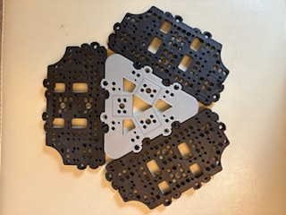
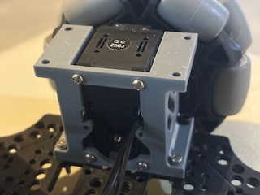
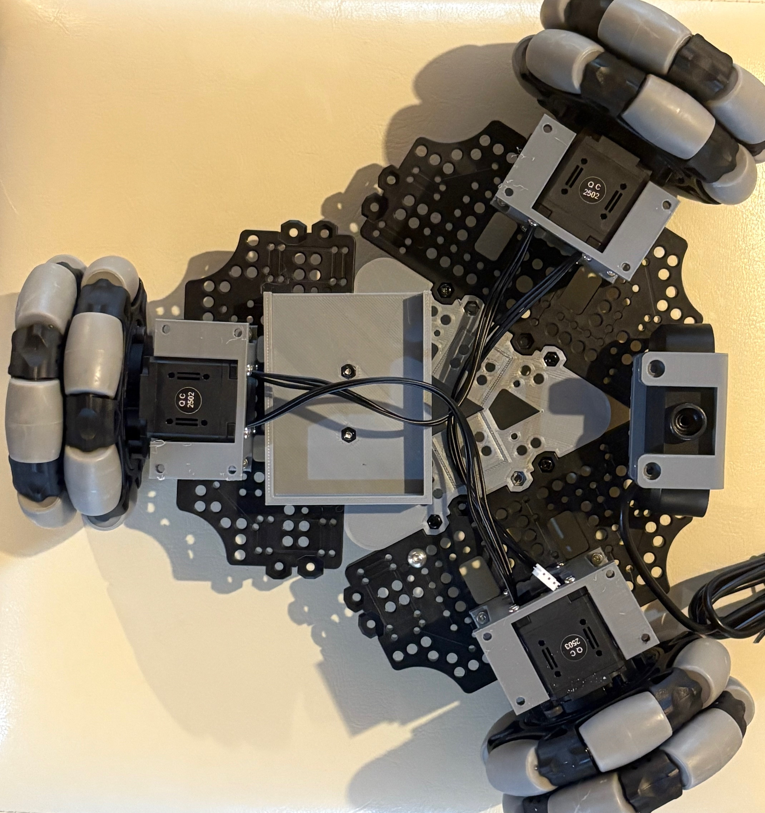
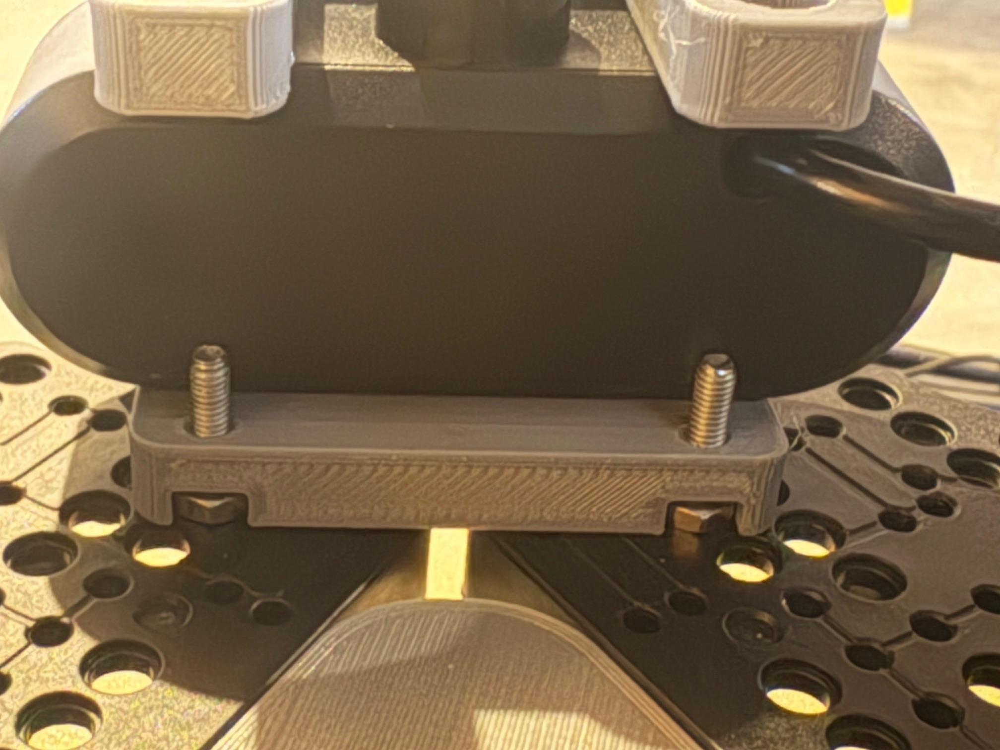
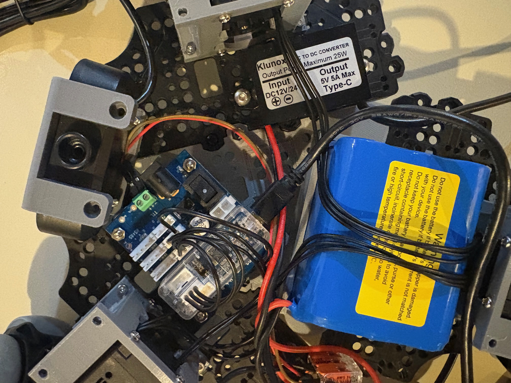

# Assembly
> **Estimated time:** 2 hours

*Exact component placements can be visualized in the [Fusion360 Online CAD](https://a360.co/4iD2gtf)*

*We assume you already have a [Koch Arm](https://github.com/jess-moss/koch-v1-1) built*
### 1. Assemble Wheel Modules (3 per robot)

1. Attach the drive motor to the motor mount using 4 m2x5 tap screws.

    

2. Attach the wheel hub to the omniwheel using 2 m4x12 machine screws.

    

3. Attach the wheel hub to the servo horn using 4 m3x16 machine screws.

    

### 2. Bottom Plate Assembly
1. Assemble both plates by attaching the 3D-printed triangular insert to the TB3 plate. Align the outer holes and secure the insert using six M3x8 machine screws and matching nuts (the ones included with the TB3 plates).
    
    

2. Screw each drive motor mount onto the bottom plate using 2 m3x12 machine screws in the front and 2 m2.5x12 machine screws in the back.
    

3. Connect the motor wires in series. Insert 2 m3 nuts into the slots on both the battery mount and the base camera mount. Then, attach the battery mount to the bottom plate using two m3x12mm machine screws. Secure the camera mount to the plate using two m3x16mm machine screws.
    

    

4. Wiring Electronics
   -    Use the wago lever connectors to connect the ground and power battery wire leads to the leads of the 12v->5v converter and the dc barrel plug adapter. 
    
   -    Mount the 12V to 5V converter to the bottom plate using two m4x16mm machine screws and two m4 nuts. Then, connect the unconnected motor wire, the USB cable, and the power wires to the U2D2 PHB. Attach standoffs to the U2D2 board, and secure it to the base plate using three m3x16mm machine screws.
    

### 3. Top plate Assembly
1. Place the raspberry pi 5 into the pi case bottom and snap on the top part of the case. 
2. Attach the Pi to the top base plate using 2 m3x12 machine screws and mount the SO-101 arm with 4 m3x20 machine screws. Using our modified SO-101 base or the original will work as there are holes for both in the plate.

    

### 4. Final Assembly
1. Feed the servo controller usb-c to usb-a, 5v usb-c power, and SO0-101 servo wires through the hole in the top base plate. 

    

2. Mount the top base plate onto the motor mounts using 4 m3x12 machine screws.

    

### 5: Attach Cameras
*Note: The mounts we designed are specific to the cameras we chose. They may need to be modified for different camera modules.*
#### (Option 1) Mounting Arducam
For these [camera's](https://www.amazon.com/Arducam-Camera-Computer-Without-Microphone/dp/B0972KK7BC) you can print these parts 1x `3DPrintMeshes/base_camera_mount.stl` 
1. Screw the base camera mount onto the bottom base plate(attach the arducam 5MP wide angle camera to the mount with 2 m2.5x12 machine screws). The cable for the camera mount can also be fed through the cutout

    

### Plug everything in and its ready!
Power the electronics by plugging in the DC barrel plug adapter to the servo motor controller and the 5v usb-c connector to the raspberry pi 5. The usb cables from the servo controller and the cameras can directly be plugged in to the raspberry pi.

 
