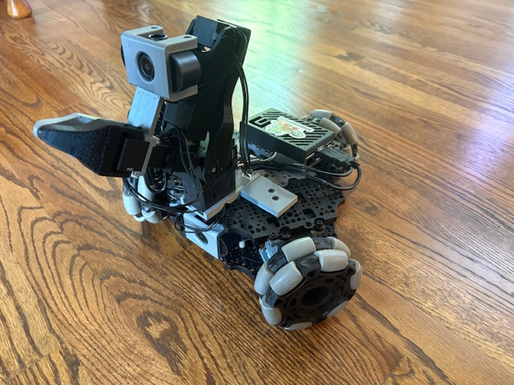
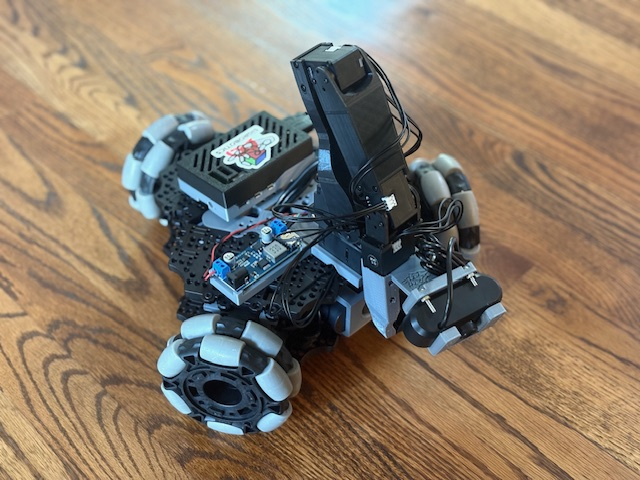

# LeKiwi

    
    
    
    

> LeKiwi - Low-Cost Mobile Manipulator | Version 1

  

## Step by step tutorial
1. [Bill of Materials](BOM.md)
2. [3D Printing](3DPrinting.md)
3. [Assembly](Assembly.md)
4. [Get started with LeRobot](https://huggingface.co/docs/lerobot/lekiwi)

## Hardware Design
#### Standardized Stacked Base Plates
- Inspired by the [open robotic platform](https://openroboticplatform.com/designrules), our base plates have 3.5mm diameter holes spaced 20mm apart for standardized mounting

#### Power
- (12V version) 12v 5A Li-ion battery
- (5V version) 65W Laptop power bank

> [!TIP]  
> If this is the first time you build robots please choose the 5V version as it’s a little bit easier to assemble. If you are more experienced and want to lift heavier objects choose the 12V version. If you want the cheapest option possible go for the wired LeKiwi version.

#### Compute
- Raspberry Pi 5
- Streaming to a Laptop

#### Drive
- 3-wheel Kiwi (holonomic) drive with omni wheels

#### Robot Arm
- [SO-ARM101](https://github.com/TheRobotStudio/SO-ARM100)

#### Sensors
- Workspace rgb camera
- Wrist rgb camera

## Software Capabilities
Goals:
- Teleoperation with controller or laptop WASD + leader arm
- Data collection pipeline
- Streaming joint angles and camera feed

## CAD Design
[Fusion 360 CAD](https://a360.co/4k1P8yO)

We also provide the [URDF](./URDF/) exported from CAD for simulation.

The open CAD migration is in [cad/](cad/): `LeKiwi_reference.FCStd` preserves the complete STEP reference assembly, while `LeKiwi.FCStd` is the editable FreeCAD-to-Xacro source covering all 45 URDF links. See its [deterministic rebuild instructions](cad/README.md).

## Check out our Dynamixel Version!

     
     

We converted LeKiwi to use ROBOTIS components by using the Koch v1.1 arm, U2D2 motor controller, and Dynamixel XL430 motors for the mobile base.  [Dynamixel LeKiwi](DynamixelLeKiwi)

## Get In Touch!

Join the project on LeRobot's [Discord server](https://discord.gg/Jtz5TJtb2u) (channel `mobile-so100-arm`)! Let us know if you have any questions, suggestions, or other feedback.

## Citation

If you use LeKiwi in your research, please cite the repository using the metadata in [CITATION.cff](CITATION.cff). GitHub's **Cite this repository** menu provides APA and BibTeX citations.

## Main Contributors
Thank you to everyone who helped on the project!

**CAD Design**: Manav Chandaka, Bhargav Chandaka, Pepijn Kooijmans

**Software**: Pepijn Kooijmans, Gloria Wang, Bhargav Chandaka, Advait Patel
